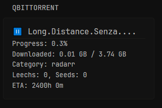
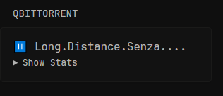

# qBittorrent API Proxy

This Go app acts as a lightweight proxy API for qBittorrent. It logs into your qBittorrent Web UI, fetches torrent info, caches it for 5 minutes, and exposes a simple authenticated HTTP endpoint to get torrent data in JSON format.

<p>
  
  
</p>

# Setup - Standalone
`docker-compose.yml`
```yaml
services:
  qbwrapper:
    container_name: qbwrapper
    image: ghcr.io/panonim/qbwrapper:latest
    ports:
      - "9911:9911"
    environment:
      USERNAME: ${QB_USERNAME}
      PASSWORD: ${QB_PASSWORD}
      BASE_URL: ${QB_URL}
      AUTH_TOKEN: ${AUTH_TOKEN}
      LISTEN_PORT: "9911"
    restart: unless-stopped
```
`.env`
```env
QB_USERNAME=
QB_PASSWORD=
QB_URL=http://IP:PORT
AUTH_TOKEN=REPLACEME
```

## Environment Variables

You **must** provide these in a `.env` file or your environment:

* `QB_URL` — base URL of your qBittorrent Web UI (e.g., `http://localhost:8080`)
* `QB_USERNAME` — your qBittorrent username
* `QB_PASSWORD` — your qBittorrent password
* `AUTH_TOKEN` — Bearer token required to access the `/qb/torrents` endpoint

## Glance
```yaml
- type: custom-api
  title: qBittorrent
  cache: 15m
  options:
    always-show-stats: true 
  subrequests:
    info:
      url: "http://${QB_URL}/qb/torrents"
      method: GET
      headers:
        Authorization: "Bearer ${AUTH_TOKEN}"  # your token
  template: |
    {{ $info := .Subrequest "info" }}
    {{ $torrents := $info.JSON.Array "" }}
    {{ $alwaysShowStats := .Options.BoolOr "always-show-stats" false }}
    {{ if eq (len $torrents) 0 }}
      <div>No torrents found.</div>
    {{ else }}
      {{ range $t := $torrents }}
        {{ $state := $t.String "state" }}
        {{ $icon := "❔" }}
        {{ if or (eq $state "downloading") (eq $state "forcedDL") }}{{ $icon = "⬇️" }}{{ end }}
        {{ if or (eq $state "uploading") (eq $state "forcedUP") }}{{ $icon = "⬆️" }}{{ end }}
        {{ if or (eq $state "pausedDL") (eq $state "stoppedDL") (eq $state "pausedUP") (eq $state "stalledDL") (eq $state "stalledUP") (eq $state "queuedDL") (eq $state "queuedUP") }}{{ $icon = "⏸️" }}{{ end }}
        {{ if or (eq $state "error") (eq $state "missingFiles") }}{{ $icon = "❗" }}{{ end }}
        {{ if eq $state "checkingDL" }}{{ $icon = "🔍" }}{{ end }}
        {{ if eq $state "checkingUP" }}{{ $icon = "🔎" }}{{ end }}
        {{ if eq $state "allocating" }}{{ $icon = "⚙️" }}{{ end }}
        {{ if eq $state "checkingResumeData" }}{{ $icon = "♻️" }}{{ end }}
        {{ $name := $t.String "name" }}
        {{ if gt (len $name) 20 }}
          {{ $shortName := printf "%s..." (slice $name 0 20) }}
        {{ else }}
          {{ $shortName := $name }}
        {{ end }}
        {{ $progress := mul ($t.Float "progress") 100 }}
        {{ $downloaded := $t.Int "downloaded" }}
        {{ $size := $t.Int "size" }}
        {{ $eta := $t.Int "eta" }}
        {{ $category := "radarr" }}
        {{ if $t.Exists "category" }}
          {{ $category = $t.String "category" }}
        {{ end }}
        {{ $numLeechs := 0 }}
        {{ if $t.Exists "num_leechs" }}
          {{ $numLeechs = $t.Int "num_leechs" }}
        {{ end }}
        {{ $numSeeds := 0 }}
        {{ if $t.Exists "num_seeds" }}
          {{ $numSeeds = $t.Int "num_seeds" }}
        {{ end }}
        {{ $gbDownloaded := div (toFloat $downloaded) 1073741824 }}
        {{ $gbSize := div (toFloat $size) 1073741824 }}
        {{ $fmtDownloaded := printf "%.2f" $gbDownloaded }}
        {{ $fmtSize := printf "%.2f" $gbSize }}
        {{ $etaStr := "" }}
        {{ if gt $eta 0 }}
          {{ $h := div $eta 3600 }}
          {{ $m := div (mod $eta 3600) 60 }}
          {{ $etaStr = printf "%dh %dm" $h $m }}
        {{ else if eq $eta 0 }}
          {{ $etaStr = "0m" }}
        {{ else }}
          {{ $etaStr = "∞" }}
        {{ end }}
        <div>
          <h2 style="font-size: 1.2em;">{{ $icon }} {{ if gt (len $name) 20 }}{{ slice $name 0 20 }}...{{ else }}{{ $name }}{{ end }}</h2>
          {{ if $alwaysShowStats }}
            <hr/>
            <div>
              <div>Progress: {{ printf "%.1f%%" $progress }}</div>
              <div>Downloaded: {{ $fmtDownloaded }} GB / {{ $fmtSize }} GB</div>
              <div>Category: {{ $category }}</div>
              <div>Leechs: {{ $numLeechs }}, Seeds: {{ $numSeeds }}</div>
              <div>ETA: {{ $etaStr }}</div>
            </div>
          {{ else }}
            <details>
              <summary>Show Stats</summary>
              <div>Progress: {{ printf "%.1f%%" $progress }}</div>
              <div>Downloaded: {{ $fmtDownloaded }} GB / {{ $fmtSize }} GB</div>
              <div>Category: {{ $category }}</div>
              <div>Leechs: {{ $numLeechs }}, Seeds: {{ $numSeeds }}</div>
              <div>ETA: {{ $etaStr }}</div>
            </details>
          {{ end }}
        </div>
      {{ end }}
    {{ end }}
```

<p>
  
  
</p>

### Glance env
You can put this app in the same place as glance and the same .env file, but in case you are using it alone please put this in your `.env`.
* `QB_URL` — base URL of your qBittorrent Web UI (e.g., `http://localhost:8080`)
* `AUTH_TOKEN` — Bearer token required to access the `/qb/torrents` endpoin

## What you get in the response

Each torrent object includes:

* `name`: Torrent name
* `category`: Assigned category in qBittorrent
* `num_leechs`: Number of leechers
* `num_seeds`: Number of seeders
* `progress`: Download progress (0 to 1)
* `state`: Torrent state (e.g., downloading, paused)
* `size`: Total size in bytes
* `downloaded`: Bytes downloaded so far
* `eta`: Estimated time remaining in seconds

## Notes

* The cache is locked for concurrency safety.
* If the qBittorrent login fails, the app exits.
* If you hit the endpoint without a valid token, you get a 401 Unauthorized.
* The app uses standard Go HTTP server and `github.com/joho/godotenv` for env loading.
