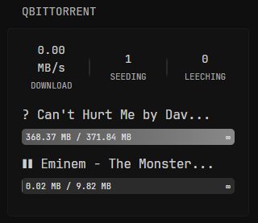
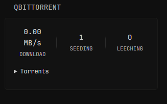

# qBWrapper

This Go app acts as a lightweight proxy API for qBittorrent. It logs into your qBittorrent Web UI, fetches torrent info, caches it, and exposes a simple authenticated HTTP endpoint to get torrent data in JSON format.

<p>
  
  
</p>

# Setup - Standalone
`docker-compose.yml`
```yaml
services:
  qbwrapper:
    container_name: qbwrapper
    image: ghcr.io/panonim/qbwrapper:latest
    ports:
      - "9911:9911"
    environment:
      TZ: Set/Me
      USERNAME: ${QB_USERNAME}
      PASSWORD: ${QB_PASSWORD}
      BASE_URL: ${QB_URL}
      AUTH_TOKEN: ${AUTH_TOKEN}
    restart: unless-stopped
    volumes:
      - ./logs:/app/logs # Optional
```
`.env`
```env
QB_USERNAME=
QB_PASSWORD=
QB_URL=http://IP:PORT
AUTH_TOKEN=REPLACEME
```
`Optional Environment Variables`
```yaml
RATE_LIMIT: "10"          # API requests per minute (default: 10)
LOG_RETENTION_DAYS: 3     # 0 for purge-on-restart
LOG_DIR: /app/logs        # Where docker should save your logs
DEBUG: true               # Logs level
LISTEN_PORT: "9911"       # Port on which qBW should listen internally
CACHE_DURATION: 5         # In minutes, set to 0 to disable cache
```

## Environment Variables

You **must** provide these in a `.env` file or your environment:

* `QB_URL` — base URL of your qBittorrent Web UI (e.g., `http://localhost:8080`)
* `QB_USERNAME` — your qBittorrent username
* `QB_PASSWORD` — your qBittorrent password
* `AUTH_TOKEN` — This is not a qBittorrent token. It’s a bearer token used by qBWrapper to control access (like a password) to the /qb/torrents endpoint.

## Glance

<details>
  <summary>Click to expand</summary>
  
```yaml
- type: custom-api
  title: qBittorrent
  cache: 1m
  options:
    hide-summary: false # Hide summary
    collapsible: false # Torrents list collapse
    hide-bar: false # Hide progress bars
    hide-completed: false # Hide finished torrents
    hide-inactive: false # Hide inactive torrents
  subrequests:
    info:
      url: "http://${QBW_URL}/qb/torrents"
      method: GET
      headers:
        Authorization: "Bearer ${AUTH_TOKEN}"  # your QBW token
  template: |
    {{ $info := .Subrequest "info" }}
    {{ $torrents := $info.JSON.Array "torrents" }}
    {{ $hideCompleted := .Options.BoolOr "hide-completed" false }}
    {{ $hideInactive := .Options.BoolOr "hide-inactive" false }}
    {{ $hideBar := .Options.BoolOr "hide-bar" false }}
    {{ $collapsible := .Options.BoolOr "collapsible" false }}
    
    {{ $summary := $info.JSON }}
    
    {{ if eq (len $torrents) 0 }}
      <div>No torrents found.</div>
    {{ else }}
    
      {{ if not (.Options.BoolOr "hide-summary" false) }}
      <!-- Summary -->
      <div style="display:flex; align-items:center; justify-content:center; text-align:center; margin-bottom:16px; color:#ccc; font-weight:normal; font-size:1.1em;">
          <div style="flex:1;">
              <div style="font-size:1em; font-weight:normal;">
                  {{ printf "%.2f MB/s" (div (toFloat ($summary.Int "total_download_speed")) 1048576) }}
              </div>
              <div style="font-size:0.75em; color:#aaa; margin-top:2px;">DOWNLOAD</div>
          </div>
          <div style="width:2px; height:2.5rem; margin:0 1rem; border-radius:2px; align-self:center; background:linear-gradient(to bottom, transparent, rgba(255,255,255,0.1) 20%, rgba(255,255,255,0.1) 80%, transparent);"></div>
          <div style="flex:1;">
              <div style="font-size:1em; font-weight:normal;">{{ $summary.Int "seeding_count" }}</div>
              <div style="font-size:0.75em; color:#aaa; margin-top:2px;">SEEDING</div>
          </div>
          <div style="width:2px; height:2.5rem; margin:0 1rem; border-radius:2px; align-self:center; background:linear-gradient(to bottom, transparent, rgba(255,255,255,0.1) 20%, rgba(255,255,255,0.1) 80%, transparent);"></div>
          <div style="flex:1;">
              <div style="font-size:1em; font-weight:normal;">{{ $summary.Int "leeching_count" }}</div>
              <div style="font-size:0.75em; color:#aaa; margin-top:2px;">LEECHING</div>
          </div>
      </div>
      {{ end }}
    
      {{ if $collapsible }}
      <details class="margin-top-5" open>
        <summary style="cursor:pointer; font-size:0.9em; color:#ccc; margin-bottom:10px;">Torrents</summary>
      {{ end }}
    
      <!-- Torrents -->
      {{ range $t := $torrents }}
        {{ $state := $t.String "state" }}
        {{ $downloaded := $t.Int "downloaded" }}
        {{ $size := $t.Int "size" }}
        {{ $progress := mul ($t.Float "progress") 100 }}
    
        {{ if and $hideCompleted (ge $downloaded $size) }}{{ continue }}{{ end }}
        {{ if and $hideInactive (not (or (eq $state "downloading") (eq $state "forcedDL") (eq $state "uploading") (eq $state "forcedUP"))) }}{{ continue }}{{ end }}
    
        {{ $isCompleted := ge $downloaded $size }}
        {{ $isSeeding := or (eq $state "uploading") (eq $state "forcedUP") }}
    
        {{ $icon := "?" }}
        {{ if $isCompleted }}{{ $icon = "✔" }}
        {{ else if or (eq $state "downloading") (eq $state "forcedDL") }}{{ $icon = "↓" }}
        {{ else if $isSeeding }}{{ $icon = "↑" }}
        {{ else if or (eq $state "pausedDL") (eq $state "stoppedDL") (eq $state "pausedUP") (eq $state "stalledDL") (eq $state "stalledUP") (eq $state "queuedDL") (eq $state "queuedUP") }}{{ $icon = "❚❚" }}
        {{ else if or (eq $state "error") (eq $state "missingFiles") }}{{ $icon = "!" }}
        {{ else if or (eq $state "checkingDL") (eq $state "checkingUP") (eq $state "allocating") }}{{ $icon = "…" }}
        {{ else if eq $state "checkingResumeData" }}{{ $icon = "⟳" }}
        {{ end }}
    
        {{ $name := $t.String "name" }}
        {{ $shortName := $name }}
        {{ if gt (len $name) 20 }}{{ $shortName = printf "%s..." (slice $name 0 20) }}{{ end }}
    
        {{ $fmtDownloaded := "" }}
        {{ $fmtSize := "" }}
        {{ if gt $size 1073741824 }}
          {{ $fmtDownloaded = printf "%.2f GB" (div (toFloat $downloaded) 1073741824) }}
          {{ $fmtSize = printf "%.2f GB" (div (toFloat $size) 1073741824) }}
        {{ else }}
          {{ $fmtDownloaded = printf "%.2f MB" (div (toFloat $downloaded) 1048576) }}
          {{ $fmtSize = printf "%.2f MB" (div (toFloat $size) 1048576) }}
        {{ end }}
    
        {{ $eta := $t.Int "eta" }}
        {{ $etaStr := "" }}
        {{ if gt $eta 0 }}
          {{ $h := div $eta 3600 }}
          {{ $m := div (mod $eta 3600) 60 }}
          {{ if ge $h 2400 }}{{ $etaStr = "∞" }}
          {{ else }}{{ $etaStr = printf "%dh %dm" $h $m }}{{ end }}
        {{ else if eq $eta 0 }}{{ $etaStr = "0m" }}
        {{ else }}{{ $etaStr = "∞" }}
        {{ end }}
    
        <div style="margin-bottom: 12px;">
          <h2 style="font-size: 1.2em; margin-bottom: 4px; color: #ccc;">{{ $icon }} {{ $shortName }}</h2>
    
          {{ if and (not $hideBar) (not $isCompleted) (not $isSeeding) }}
            <div style="width: 100%; height: 20px; background: #2b2b2b; border-radius: 5px; overflow: hidden; position: relative; font-size: 0.8em; color: #e0e0e0; display: flex; align-items: center; justify-content: space-between; padding: 0 5px; box-sizing: border-box;">
              <div style="width: {{ printf "%.1f" $progress }}%; height: 100%; background: linear-gradient(90deg, #555555, #888888); position: absolute; top: 0; left: 0;"></div>
              <div style="position: relative; z-index: 1; width: 100%; display: flex; justify-content: space-between;">
                <span>{{ $fmtDownloaded }} / {{ $fmtSize }}</span>
                <span>{{ $etaStr }}</span>
              </div>
            </div>
          {{ end }}
        </div>
    
      {{ end }}
    
      {{ if $collapsible }}
      </details>
      {{ end }}

    {{ end }}
```

</details>

<p>
  
  
</p>

### Glance env
You can put this app in the same place as glance and the same .env file, but in case you are using it alone please put this in your `.env`.
* `QBW_URL` — base URL of your qBittorrent Wrapper (e.g., `http://localhost:9911`)
* `AUTH_TOKEN` — This is not a qBittorrent token. It’s a bearer token used by qBWrapper to control access (like a password) to the /qb/torrents endpoint.
